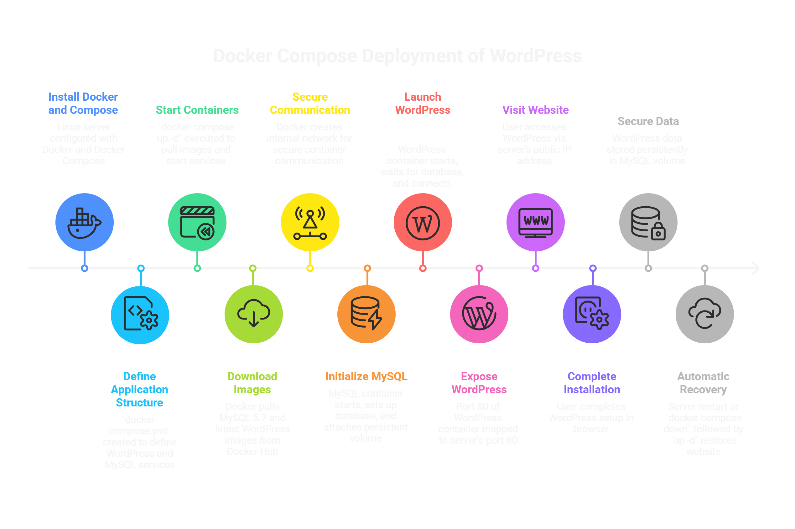

# WordPress Deployment using Docker Compose on AWS EC2

## Project Overview
This project demonstrates how to deploy a WordPress application using Docker and MySQL on an AWS EC2 instance.  
Docker Compose is used to manage multiple containers and persistent storage.  
The goal of this project is to practice real-world DevOps skills like containerization, service orchestration, and cloud deployment.

## Architecture
- WordPress container (frontend + PHP)
- MySQL container (database)
- Docker volume for persistent database storage
- Port mapping: EC2 port 80 → WordPress container port 80

    


---

## Tech Stack

| Category | Tools/Technologies |
|----------|-------------------|
| Containerization | Docker |
| Orchestration | Docker Compose |
| Cloud Platform | AWS EC2 (Linux) |
| Application | WordPress |
| Database | MySQL |

---

## Project Structure

```
Wordpress-docker-compose
    ├── docker-compose.yml
    ├── README.md
    └── Architecture/
```
---

## Features

- WordPress and MySQL multi-container deployment  
- Docker Compose orchestration  
- Persistent database storage with volumes  
- Deployment on AWS EC2  
- Accessible via public IP in browser

---

## Step-by-Step Deployment Guide (AWS EC2 + Docker Compose)

1. Launch EC2 Instance & SSH 
    - **Ubuntu 22.04**   
    - Instance type: `t2.micro` (free tier)  
    - Security Group, allow:
        - SSH (22)
        - HTTP (80)

2. Install Docker and start
    ```
    sudo apt install docker -y
    sudo systemctl start docker
    sudo systemctl enable docker
    ```

3. Install Docker Compose command
    ```
    sudo curl -L "https://github.com/docker/compose/releases/download/v2.29.7/docker-compose-$(uname -s)-$(uname -m)" -o /usr/local/bin/docker-compose
    ```
4. Make command executable
    ```
    sudo chmod +x /usr/local/bin/docker-compose
    ```

5. Create Project Folder - WordPress
    ```
    mkdir wordpress-docker
    cd wordpress-docker
    ```

6. Write docker-compose.yml file 

    [Docker-compose.yml](docker-compose.yml) 

7. Start Containers
    ```
    docker compose up -d
    ```

9. Check containers
    ```
    docker ps
    ```
10. Open in Browser
    ```
    http://ec2-public-ip
    ```